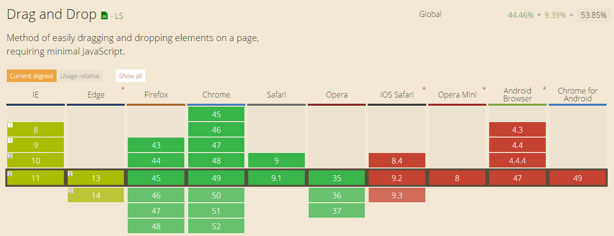
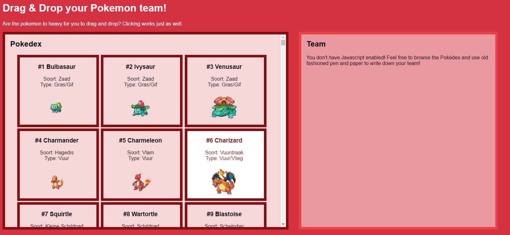
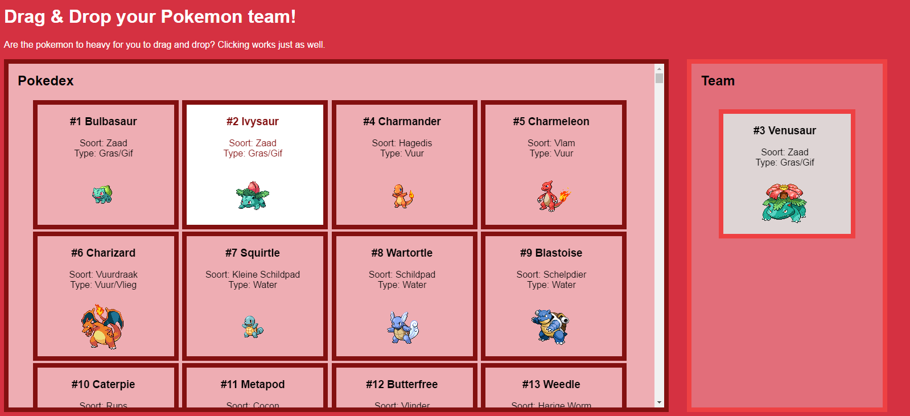

##AVV3 - Drag & Drop - Progressive Enhanchement
http://wasknijper.github.io/MWD-BrowserTechnologies/avv3/

###Drag and drop supported:
		

### Geen JS / hele oude browser
Ik heb voor deze app eerst een container met alle pokémon images gemaakt. Deze linken allemaal naar een eigen pagina. (Bijv. Bulbasaur linkt naar /1.html, omdat hij #1 is in de pokedex.). Hier zou een back-end systeem voor kunnen bouwen om de mogelijkheid te geven om de Pokemon zo aan het team toe te voegen, voor als de user geen JS heeft.

### Klein beetje JS

Als de gebruikers browser evenListeners support, dan wordt er gebruik gemaakt van de JS. Hier in vang ik het normale gedrag van de links af en ipv. dat de gebruiker naar de pagina van de pokemon gaat, wordt de pokemon aan het team toegevoegt. De array waar de pokemon in zit zou je dan weer kunnen pushes naar de server.

### Drag an drop support 

Als laatste word er getest of de browser van de gebruiker drag & drop support. Als dit werkt kan de gebruiker ook slepen. Wanneer de gebruiker sleept worden de gebieden waar naar toe kan worden gesleept een andere kleur. Omdat sommige browsers wel zeggen dat ze drag & drop kunnen, maar dat toch niet supporten(vooral mobile devices) heb ik de klik mogelijkheid erin gelaten.

